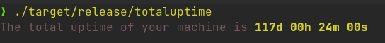

# Total Machine Uptime



## Origin

I wanted to know how much time my PC has been up since the first time I booted it.

After doing some research, I found out that the Linux command `last reboot` gives the uptime of the PC by boot session.

All I have to do is make a script to get and parse the data, and then sum up all the session uptimes (+some pretty formatting).

## Installation

> This TUI **doesn't work** on other OS than linux.

Build from source with `cargo`, or download (_if you're on linux_) the **linux** executable from the [`release page`](https://github.com/Ilingu/rtkill/releases)

```bash
cargo build --release # will creates a single executable for your os in ./target/release, named "rtkill" (with the associated executable extension in your os)
```

## Made with:

1. **Elegance** ✅
2. `RUST` ✨🦀
3. [colored](https://docs.rs/colored/latest/colored/index.html) ♥
